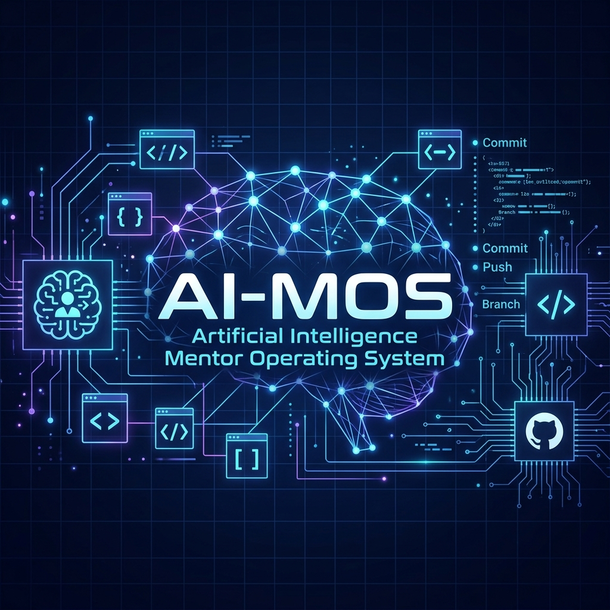

# AI-MOS (Artificial Intelligence Mentor Operating System)



AI-MOS is a state-of-the-art, personalized learning ecosystem designed to transform students and aspiring engineers into production-ready software developers. By rejecting standard chat-bot interactions, AI-MOS utilizes **Socratic pedagogy** to guide learners through first-principles thinking rather than spoon-feeding answers.

Built around a **Bring Your Own Key (BYOK)**, stateless, decentralized backend gateway, AI-MOS keeps your LLM keys local while delivering rich, interactive learning interfaces, dynamic tracking systems, and simulated, high-pressure technical interviews.

---

## ⚡ Quick Start: How to Run

Follow these quick commands to spin up the complete local environment:

### 1. Database (PostgreSQL)
Ensure Docker Desktop is running, then launch the database container:
```bash
docker compose up -d
```

### 2. Backend (FastAPI)
Open a terminal in the [Backend/](file:///d:/AI-MOS%20Project/Backend) folder:
```bash
# 1. Copy the environment configuration
copy .env.example .env

# 2. Activate the pre-configured virtual environment
# On Windows:
.venv\Scripts\Activate.ps1
# On macOS/Linux:
source .venv/bin/activate

# 3. Apply schema migrations (creates tables and seeds curriculum nodes)
alembic upgrade head

# 4. Run the development server
uvicorn app.main:app --reload --host 127.0.0.1 --port 8000
```

### 3. Frontend (React + Vite)
Open a terminal in the [Frontend/](file:///d:/AI-MOS%20Project/Frontend) folder:
```bash
# 1. Install Node modules
npm install

# 2. Run the Vite development server
npm run dev
```
Finally, navigate to **`http://localhost:5173`** in your web browser. Click the key icon in the top right corner to set up your LLM API credentials, and start your Socratic learning contract!

---

## 🌟 Core Architectural Pillars

### 1. Conversational Learning Contract Intake
Before unlocking the dashboard, students undergo an interactive diagnostic chat to build a personalized **Learning Profile Matrix** consisting of 15 variables (including target role, schedule, OS, baseline proficiency, weaknesses, and hardware limits). On the 5th turn, the AI compiler extracts this matrix into a structured JSON configuration and saves it to the database to tailor the curriculum tree.

### 2. Socratic Prompt Compiler & No-Code Safeguard
The platform embeds Socratic parameters directly into the instruction compilers. When a student fails verification checkpoints:
* **The No-Code Safeguard** is dynamically activated.
* The Socratic Mentor is strictly **forbidden** from outputting copy-pasteable markdown code blocks.
* Instead, it guides the student line-by-line using ASCII diagrams, plain-English logic, and document pointers.

### 3. High-Pressure Zoho Mock Interview Simulator
Students can enter the **Zoho Panel** to face **Srinivasan**, a Senior Architect technical panelist. 
* Srinivasan evaluates technical depth, edge cases, and architectural reasoning.
* If a response is evaluated with a score below `6/10`, the system automatically increments/logs active weakness flags in the database's `weak_areas` tracking system, dynamically adjusting the student's curriculum review path.

### 4. Stateless BYOK Architecture
Users configure their own credentials (NVIDIA NIM, OpenAI, Anthropic, Gemini) directly from the client. The frontend passes provider options and API keys strictly in HTTPS request headers on a per-request basis. The server processes, streams, and releases resources instantly, ensuring absolute API key security with zero disk or log persistence.

---

## 📂 Project Directory Structure

```text
d:\AI-MOS Project
├── Backend/
│   ├── app/
│   │   ├── api/
│   │   │   └── v1/
│   │   │       ├── endpoints/
│   │   │       │   ├── interview.py     # Zoho Mock Interview endpoints
│   │   │       │   ├── onboarding.py    # Learning Contract intake endpoints
│   │   │       │   └── curriculum.py    # Progress & node checkpoint controllers
│   │   │       └── api.py              # Router registrations
│   │   ├── core/
│   │   │   ├── config.py               # Env configuration & settings
│   │   │   └── database.py             # SQLAlchemy async engine session
│   │   ├── migrations/                 # Alembic DDL schema & data migrations
│   │   └── services/
│   │       ├── llm_factory.py          # Provider-agnostic stream generator
│   │       ├── prompt_compiler.py      # Socratic prompt context aggregator
│   │       └── onboarding_service.py   # Atomic profile transaction logic
│   ├── requirements.txt                # Python package list
│   └── alembic.ini                     # Alembic configuration
├── Frontend/
│   ├── src/
│   │   ├── components/
│   │   │   ├── OnboardingChat.tsx      # Diagnostic protocol component
│   │   │   ├── DashboardOverview.tsx   # OS mission control home screen
│   │   │   ├── CurriculumTree.tsx      # Interactive syllabus tree navigator
│   │   │   ├── LessonCanvas.tsx        # Active reading/coding workspace
│   │   │   ├── SocraticConsole.tsx     # Compute Hub (Mentor & Zoho Panel tabs)
│   │   │   └── BYOKModal.tsx           # API key credentials popup
│   │   ├── App.tsx                     # Main layout & routing orchestration
│   │   └── main.tsx                    # React entrypoint
│   ├── package.json                    # Node dependencies & run scripts
│   └── vite.config.ts                  # Vite configuration
├── Docs/                               # Architecture blueprints & SRS specs
│   └── assets/                         # Documentation images & assets
├── curriculum/                         # Core syllabus markdown nodes
└── docker-compose.yml                  # PostgreSQL service configuration
```

---

## 🚀 Local Development Setup

To run this project on your system, follow the step-by-step guide below.

### 1. Database Setup
Start the containerized PostgreSQL database:
```bash
docker compose up -d
```
*This starts a local PostgreSQL instance on port `5432` and opens pgAdmin at `http://localhost:5050`.*

### 2. Backend Setup
1. Navigate to the backend directory:
   ```bash
   cd Backend
   ```
2. Create your `.env` configuration file:
   ```bash
   copy .env.example .env
   ```
3. Generate a secure secret key and set it in your `.env`:
   ```bash
   python -c "import secrets; print(secrets.token_hex(32))"
   ```
4. Activate the virtual environment:
   * **Windows (PowerShell)**: `.venv\Scripts\Activate.ps1`
   * **macOS/Linux**: `source .venv/bin/activate`
5. Install backend dependencies:
   ```bash
   pip install -r requirements.txt
   ```
6. Run Alembic migrations (this builds database schemas and automatically seeds curriculum nodes):
   ```bash
   alembic upgrade head
   ```
7. Run the FastAPI application:
   ```bash
   uvicorn app.main:app --reload --host 127.0.0.1 --port 8000
   ```

### 3. Frontend Setup
1. Open a new terminal in the frontend directory:
   ```bash
   cd Frontend
   ```
2. Install package dependencies:
   ```bash
   npm install
   ```
3. Start the Vite server:
   ```bash
   npm run dev
   ```
4. Open the application at `http://localhost:5173`.

---

## 🤝 Contribution Guidelines

We welcome contributions from developers! To contribute:

1. **Fork the Repository**: Clone the project to your local machine.
2. **Create a Feature Branch**: Use descriptive branch naming schemes (e.g., `feature/socratic-hardening` or `bugfix/onboarding-matrix`).
3. **Verify with Tests**: Ensure backend changes compile and pass unit/integration tests before submission:
   ```bash
   pytest
   ```
4. **Adhere to Code Guidelines**: Maintain typing guidelines, document database schemas using FastAPI Pydantic models, and follow the Socratic pedagogical framework in any custom prompt compilations.
5. **Submit a PR**: Provide a descriptive pull request outlining changes, test verifications, and visual changes.

---

## 📝 License & Legal Warning

This project is licensed under a **Custom Educational & Non-Commercial License**. See [LICENSE](LICENSE) for details.

> [!CAUTION]
> **LEGAL NOTICE FOR FORKS, CLONES, AND COPIES:**
> * **Educational Use Only:** This repository and its source code are public **strictly for free personal learning and educational use**. You are **not permitted** to sell, monetize, distribute, or bundle this code or products derived from it for monetary gain or commercial services.
> * **Credits & Attribution Required:** If you fork, clone, copy, or modify this code for your own educational projects, you **must provide prominent credit and attribution to the original author (Arun M)** and link back to this original repository. You are strictly **forbidden from claiming ownership** of this project or presenting it as your own original creation.
> * **Enforcement:** Any commercial exploitation or failure to provide proper attribution as required will result in a **formal legal complaint, intellectual property infringement claims, and platform takedowns (such as DMCA)** filed by the owner (**Arun M**).


